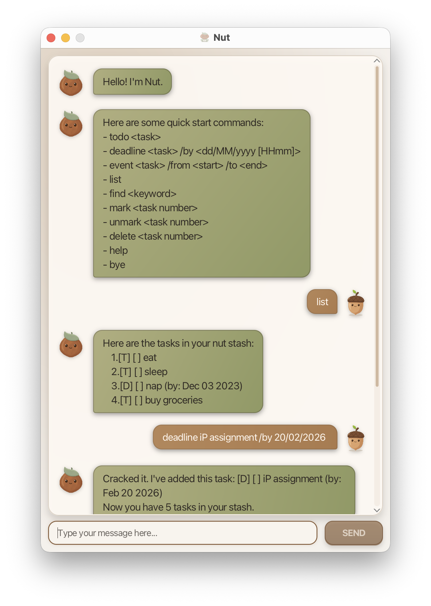

# Nut User Guide

Nut is a lightweight chatbot task manager that helps you track todos, deadlines, and events using simple text commands.

## Features

### Command format notes

- Commands should be entered in lowercase (e.g., `list`, `todo read book`).
- `TASK_NUMBER` refers to the number shown in the `list` output.
- Use `dd/MM/yyyy` or `dd/MM/yyyy HHmm` for deadlines.
- `yes`/`y` and `no`/`n` are only used when Nut asks you to confirm a duplicate task.

### Viewing help: `help`

Shows the in-app command rundown.

Format: `help`

### Greeting Nut: `hi`, `hello`, `hey`

Sends a greeting and gets a friendly reply.

Format: `hi` or `hello` or `hey`

### Adding a todo: `todo`

Adds a simple todo task.

Format: `todo DESCRIPTION`

Examples:
- `todo borrow book`
- `todo submit reflection`

### Adding a deadline: `deadline`

Adds a deadline task.

Format:
- `deadline DESCRIPTION /by dd/MM/yyyy`
- `deadline DESCRIPTION /by dd/MM/yyyy HHmm`

Examples:
- `deadline return library book /by 03/12/2026`
- `deadline submit report /by 15/09/2026 1800`

### Adding an event: `event`

Adds an event task with start and end fields.

Format: `event DESCRIPTION /from START /to END`

Examples:
- `event project meeting /from Mon 2pm /to 4pm`
- `event hackathon /from 9am /to 6pm`

### Listing tasks: `list`

Shows all tasks in your task list.

Format: `list`

### Finding tasks: `find`

Shows tasks whose descriptions contain the given keyword.

Format: `find KEYWORD`

Examples:
- `find report`
- `find book`

### Marking a task as done: `mark`

Marks the specified task as completed.

Format: `mark TASK_NUMBER`

Example: `mark 2`

### Unmarking a task: `unmark`

Marks the specified task as not completed.

Format: `unmark TASK_NUMBER`

Example: `unmark 2`

### Deleting a task: `delete`

Deletes the specified task.

Format: `delete TASK_NUMBER`

Example: `delete 3`

### Exiting the app: `bye`

Closes Nut.

Format: `bye`

### Duplicate confirmation: `yes` / `no`

If you add a task with a duplicate name, Nut will ask if you still want to add it.

Reply with:
- `yes` or `y` to add anyway
- `no` or `n` to cancel

## Saving data

Nut saves your tasks automatically after each command to:

- `nut.txt` (project root)

No manual save command is required.

## Command summary

| Action | Format |
| --- | --- |
| Help | `help` |
| Greet | `hi` / `hello` / `hey` |
| Add todo | `todo DESCRIPTION` |
| Add deadline | `deadline DESCRIPTION /by dd/MM/yyyy` |
| Add deadline with time | `deadline DESCRIPTION /by dd/MM/yyyy HHmm` |
| Add event | `event DESCRIPTION /from START /to END` |
| List tasks | `list` |
| Find tasks | `find KEYWORD` |
| Mark task | `mark TASK_NUMBER` |
| Unmark task | `unmark TASK_NUMBER` |
| Delete task | `delete TASK_NUMBER` |
| Confirm duplicate | `yes` / `y` |
| Cancel duplicate | `no` / `n` |
| Exit | `bye` |

## FAQ

**Q: Where are my tasks stored?**  
A: In `nut.txt` at the project root.

**Q: Can I edit `nut.txt` manually?**  
A: You can, but invalid format may cause loading issues. Back it up first.

**Q: Why did Nut ask for `yes`/`no` after I added a task?**  
A: Nut detected a duplicate task name and is asking for confirmation.
